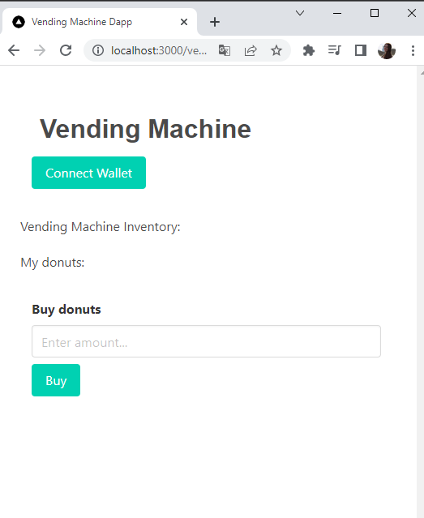
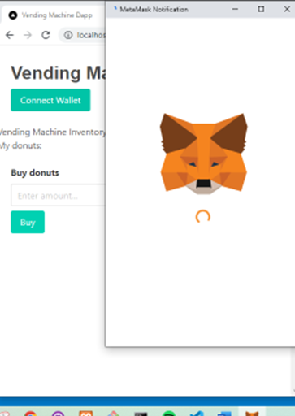
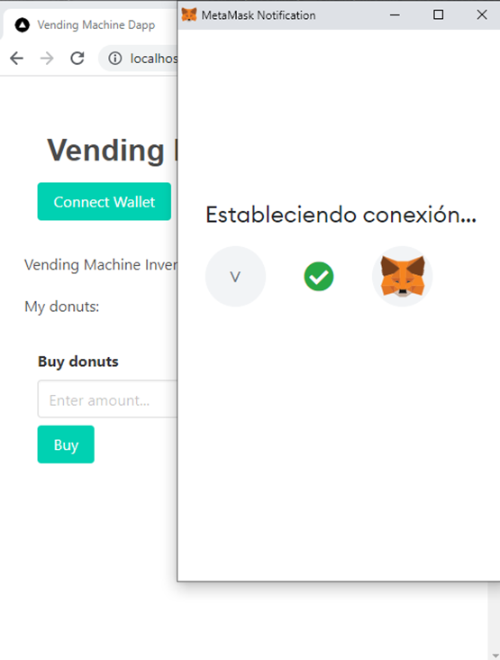

# Web3-Vending-Maching-Dapp

<h2> Metamask Connection with React and Web3.js <h2/>

 
                             

<h2> Smart Contract Deployed <h2/>

   
 FYI: Need to debug: “No "from" address specified in neither the given options, nor the default options.” Once the wallet is connected, in order to buy it needs to recognize the acct which is not currently happening.                                                             
addres -> account[0] | My account would be the 1 element in the array.                                                           
